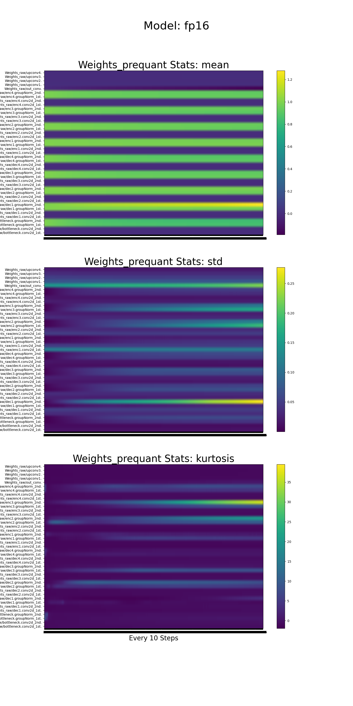
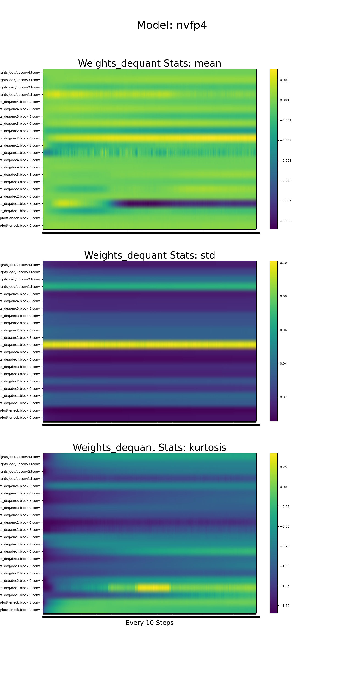
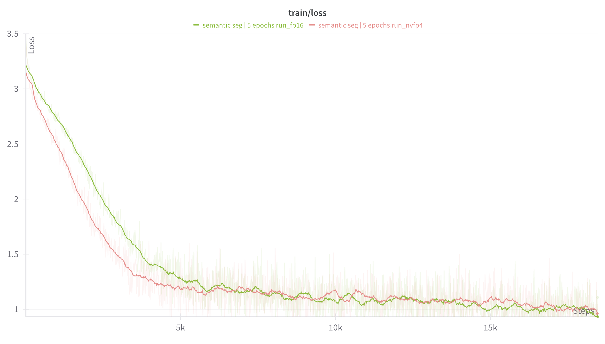
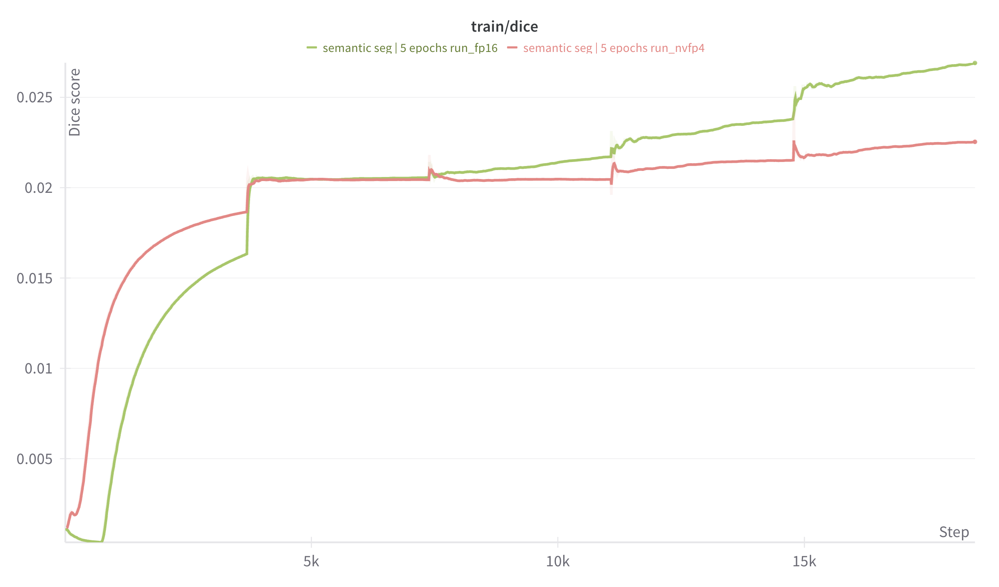

# CNN FP4 Emulation 🧪🚀

Welcome to **cnn_fp4_emulation** – a playground for exploring **4-bit floating-point (NVFP4) quantisation** on convolutional neural networks while keeping the whole training loop fully differentiable.  Our goal is to understand whether we can run semantic-segmentation & instance-segmentation workloads on forthcoming Blackwell GPUs **without giving up accuracy** – and how much latency we can save in the process.

## 1 Objective 🎯
*Emulate NVFP4 on UNet-style architectures for COCO-2017 segmentation / detection,* compare against a full-precision baseline, and study the trade-off between accuracy and hardware latency.

## 2 Approach 🔬
• **Dataset:** COCO-2017 images + masks.  
• **Losses:** Dice Loss for semantics, Instance Loss for object masks.  
• **Baseline:** regular UNet trained in autocast **FP16** (keeps FP32 master weights).  
• **Quantised model:** weights and activations go through Kitchen’s NVFP4 *straight-through estimator* so gradients flow during back-prop. All **Conv / ConvT** layers are quantised; **GroupNorms and the final output conv stay full-precision** – a choice backed by a kurtosis study of the baseline weights.

## 3 Training 🚂
Both models are trained serially via the same trainer script; WANDB captures raw-FP, int-code and de-quantised weights plus gradients.  The quantised run helps us project real-world latency on Blackwell hardware while we experiment with techniques (scaling strategy, learnable clipping, etc.) to close the accuracy gap.

## 4 Inference ⚡
Once a quantised checkpoint reaches baseline accuracy, we can export an *inference-only* version that stores NVFP4 weights and applies **on-the-fly de-quantisation** – hitting the sweet spot of *high IoU* & *low latency*.

---
Two flavours of UNet live here:

| Model | Precision | Quantisation Path |
|-------|-----------|-------------------|
| `UNetFP16` | FP32 → FP16 autocast | No quantisation – a high-precision baseline ✅ |
| `UNetNVFP4` | FP32 → FP4 (E2M1) emulated | Kitchen 🔪 autograd fake-quant on every Conv/ConvT layer (GroupNorm & output layer stay full-precision) |

The repository is set up to **train both models sequentially** and log a *ton* of telemetry to Weights & Biases:

🟢 Raw FP weights  
🟣 Int-encoded FP4 weights  
🔵 De-quantised FP4 weights  
🟡 Gradients

Everything is saved hierarchically under `plots/heatmaps/<model>/…` so runs never overwrite each other.

---
## Quick-Start Tutorial ⚡🛠️

```bash
# 1️⃣ Clone & enter repo (if not already inside)
cd cnn_fp4_emulation

# 2️⃣ Create & activate a virtual environment
python3 -m venv env
source env/bin/activate

# 3️⃣ Install Python deps
pip install -r requirements.txt

# 4️⃣ Build the Kitchen C++/CUDA extension
cd models/kitchen && python setup.py install && cd ../../..

# 5️⃣ Train both models on GPU-4 with 0.25 channel scaling
python main.py \
  --models fp16 nvfp4 \
  --model_scale_factor 0.25 \
  --logf 50
```

After training you’ll find artefacts in:
```
plots/heatmaps/
├── fp16/
│   ├── weights/
│   │   └── prequantize/semantic_weights.{png,html,json}
│   └── gradients/semantic_gradients.{png,html,json}
└── nvfp4/
    ├── weights/
    │   ├── prequantize/
    │   ├── quantized/
    │   └── dequantized/
    └── gradients/
```

---
## What We Learned 📚
1. **Conv / ConvT kernels are friendly to FP4.**  Their weight distributions are near-Gaussian, so they quantise cleanly with negligible information loss.
2. **GroupNorm weights are special.**  Each weight acts as a scaling factor tied to per-group statistics &mdash; high kurtosis makes them sensitive, so we leave them full-precision.
3. **The final projection layer stays FP16.**  It maps hidden channels back to pixel space; quantising it hurts mIoU more than it saves latency.

## Results 📊

### Semantic Segmentation

#### Weights Heat-map

<p align="center">
  
  
</p>

#### Gradient Heat-map
<p align="center">
  
  
</p>

#### Training Curve





The quantised run (red) closely tracks the full-precision baseline (green), confirming that the NVFP4 emulation and straight-through training procedure preserve convergence behaviour.

### Instance Segmentation

*(Placeholder for future results. Add visualisations once the instance-level training run is complete.)*

## Roadmap ✨
- [ ] Implement native **NVFP4 convolution kernels** so Conv/ConvT layers run quantised end-to-end on GPU.  
- [ ] Benchmark & analyse **training behaviour with true CUDA GEMM** (no emulation) to validate gradients and convergence.  
- [ ] Investigate techniques (scale tuning, quant-aware fine-tuning, loss re-weighting) to **bridge any performance drop** caused by quantisation.  
- [ ] **Extend the pipeline to object detection** (e.g. RetinaNet / YOLO) and repeat the FP16 vs NVFP4 comparison.

PRs & issues welcome – let’s push FP4 to its limits! 🤖💾 

--- 